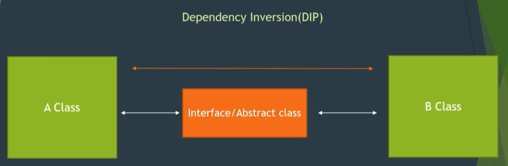

# InversionOfControl : Abstraction & Decoupling
## Inversion of Control(IoC) Principle
- It is a design principle in which the control of object creation and flow of program execution is inverted or moved away from the application code to an external framework or container. 
This means that the flow of control in a program is determined by a framework or runtime environment rather than being controlled explicitly by the application code. IoC is a broad concept that encompasses various techniques and patterns to achieve decoupling and flexibility in software systems.

### **Dependency Inversion Principle(DIP)**
- It is one of the 5 SOLI**D** principles
- It is a software design principle related to object-oriented programming. It suggests that 'high-level modules should not depend on low-level modules but both should depend on abstractions' (interfaces or abstract classes). 
- This principle encourages the use of interfaces to decouple classes from their concrete implementations, promoting flexibility, extensibility, and easier maintenance of the codebase.
- DIP is a design principle advocating for abstraction and decoupling by ensuring that higher-level modules depend on abstractions (interfaces) rather than concrete implementations.

**Soyutlama(Abstraction) kavramı:** Ne kullanılacaksa onun bilgisi aktarılır.



### **Dependency Injection Principle(DIP)**
- It  is a specific technique used to implement IoC. 
- It is a design pattern where the dependencies of a class are provided externally (i.e., injected) rather than created internally. 
- This helps in achieving loose coupling between classes because the class does not directly create its dependencies but instead receives them from an external source (e.g., a framework or a container). 
        
**There are typically three types of dependency injection: *constructor injection*, *setter injection*, and *interface injection*.**

**1. Constructor Injection**
    Constructor injection involves providing the dependent objects through a class constructor. This is one of the most common ways to implement dependency injection. It promotes better testability and maintainability.
```cs
// Interface representing a dependency
public interface ILogger
{
    void Log(string message);
}

// Class with constructor injection
public class CustomerService
{
    private readonly ILogger _logger;

    // Constructor with ILogger dependency injected
    public CustomerService(ILogger logger)
    {
        _logger = logger;
    }

    public void AddCustomer(string name)
    {
        _logger.Log($"Customer '{name}' added.");
        // Additional logic to add a customer...
    }
}

// Usage of CustomerService with injected ILogger
public class Program
{
    public static void Main()
    {
        // Create a specific implementation of ILogger (e.g., FileLogger or ConsoleLogger)
        ILogger logger = new ConsoleLogger();

        // Inject logger into CustomerService through constructor
        CustomerService customerService = new CustomerService(logger);

        // Use CustomerService
        customerService.AddCustomer("idincern");
    }
}
```

**2. Setter Injection**
    Setter injection involves providing the dependent objects through public setter methods.
```cs
// Class with setter injection
public class OrderProcessor
{
    private ILogger _logger;

    // Setter method for ILogger injection
    public void SetLogger(ILogger logger)
    {
        _logger = logger;
    }

    public void ProcessOrder(int orderId)
    {
        // Process the order...
        _logger.Log($"Order {orderId} processed.");
    }
}

// Usage of OrderProcessor with injected ILogger
public class Program
{
    public static void Main()
    {
        // Create a specific implementation of ILogger
        ILogger logger = new ConsoleLogger();

        // Create an instance of OrderProcessor
        OrderProcessor orderProcessor = new OrderProcessor();

        // Inject logger using setter injection
        orderProcessor.SetLogger(logger);

        // Use OrderProcessor
        orderProcessor.ProcessOrder(123);
    }
}

```
**3. Interface Injection**
    Interface injection involves implementing an interface that defines methods to inject dependencies.

```cs
// Interface for dependency injection
public interface IEmailService
{
    void SendEmail(string to, string subject, string body);
}

// Class implementing interface injection
public class NotificationService : IEmailService
{
    private ILogger _logger;

    // Implementing the interface method with dependency injection
    public void SendEmail(string to, string subject, string body)
    {
        // Logic to send email...
        _logger.Log($"Email sent to '{to}' with subject '{subject}'.");
    }

    // Method to inject ILogger
    public void SetLogger(ILogger logger)
    {
        _logger = logger;
    }
}

// Usage of NotificationService with injected ILogger
public class Program
{
    public static void Main()
    {
        // Create a specific implementation of ILogger
        ILogger logger = new ConsoleLogger();

        // Create an instance of NotificationService
        NotificationService notificationService = new NotificationService();

        // Inject logger using interface injection
        notificationService.SetLogger(logger);

        // Use NotificationService (implicitly using IEmailService)
        notificationService.SendEmail("idincern@gmail.com", "Test", "This is a test email.");
    }
}
```